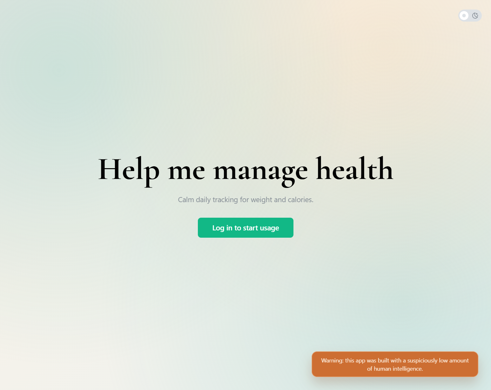
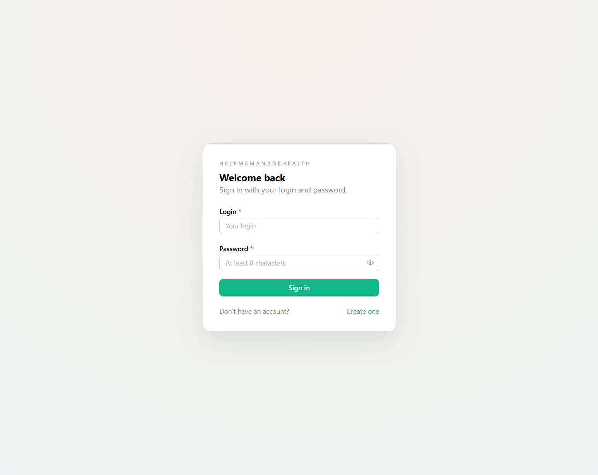
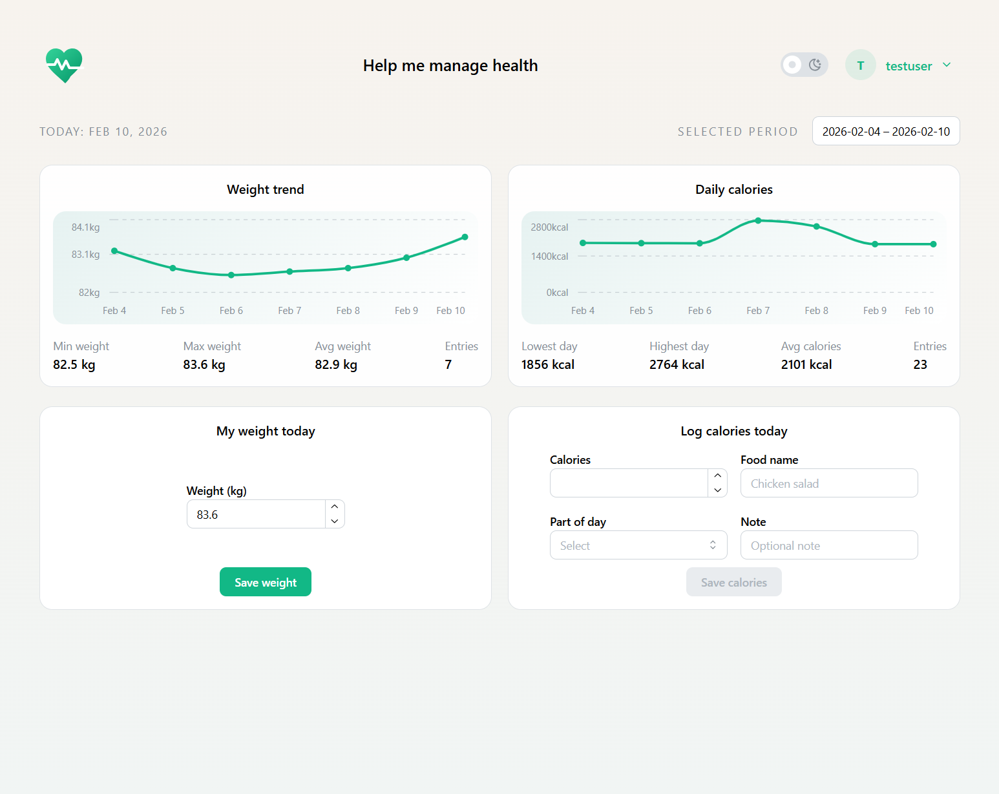
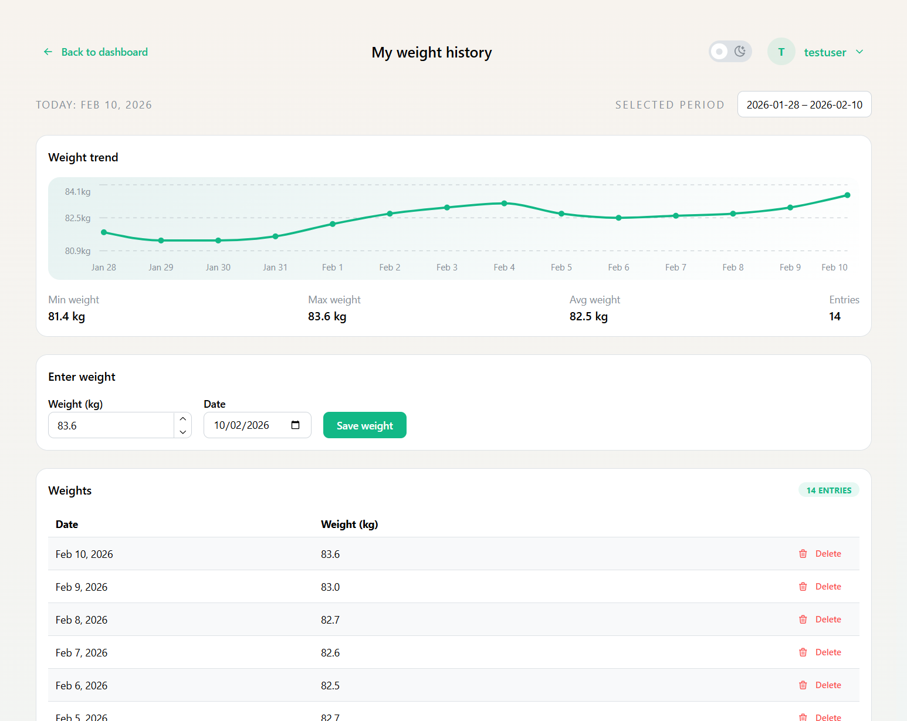
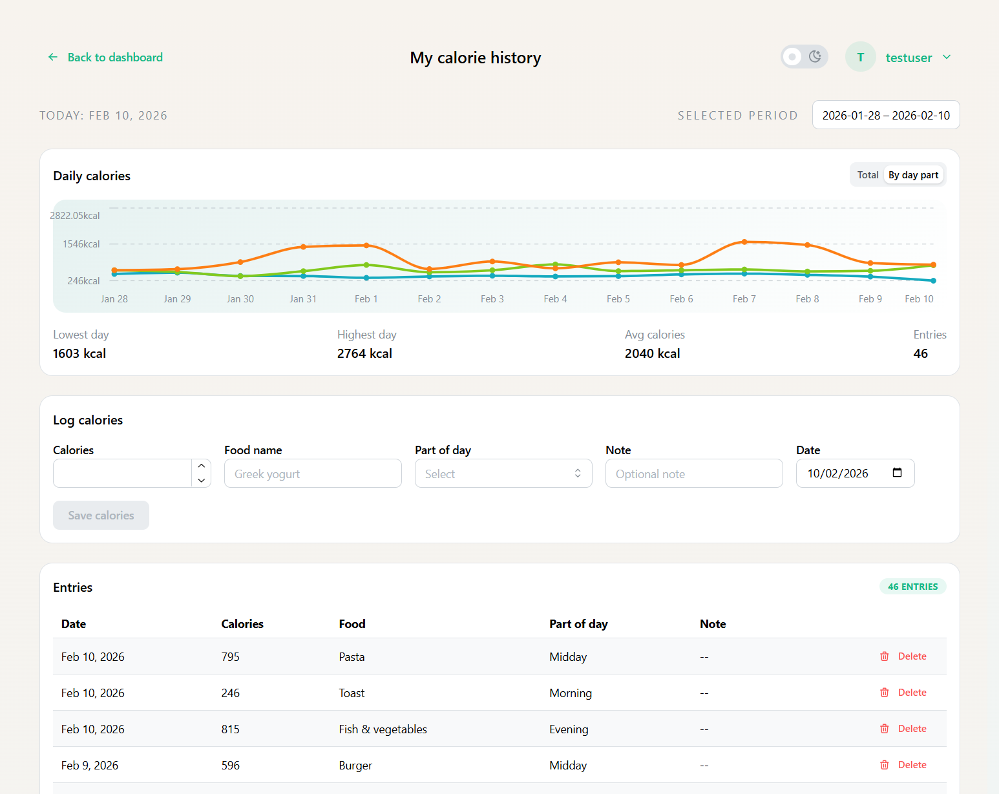

# HMMH
HelpMeManageHealth (HMMH) is a modular web application to track user weight and daily calorie intake.
It is built as an Nx monorepo with a React + TypeScript UI, a .NET REST API, and a PostgreSQL database.

The only manually edited files in the repo are files inside [.used_prompts](.used_prompts/) and [README.md](README.md).
The rest of the repo was modified using Github Copilot with selected GPT-5.2-Codex model

## Screenshots

  
More screenshots

  <table>
    <tr>
      <td></td>
      <td></td>
    </tr>
    <tr>
      <td></td>
      <td></td>
    </tr>
  </table>

## Repository Structure
- [apps/hmmh-ui](apps/hmmh-ui): React + TypeScript + Mantine UI (Vite)
- [apps/hmmh-api](apps/hmmh-api): ASP.NET Core API with EF Core + OpenIddict
- [apps/hmmh-api/Db](apps/hmmh-api/Db): Database context, models, migrations, scripts, and PostgreSQL container setup

## Prerequisites
- Node.js 22+ (LTS recommended) and npm
- .NET SDK 9.0
- Docker Desktop

## Known issues during local start
If Docker is installed inside WSL then `db:up` from the list below might not be executed correctly and you need to run `docker compose -f apps/hmmh-api/Db/docker-compose.yml up -d` in the repo root manually.

## Quickstart (local development)
Run all commands from the repo root step by step.

1. Install dependencies
	- `npm install`
2. Start PostgreSQL
	- `npm run db:up`
3. Apply SQL scripts (optional step to put test data in)
	- `npm run db:apply-scripts`
4. Start the API
	- `npm run api:run`
5. Start the UI
	- `npm run ui:dev`

## Test data
As part of the SQL scripts there are some test data inserted.
The default test user has

**Login**: testuser

**Password**: 12345678

## Useful local URLs
- UI: http://localhost:4200
- API Swagger: https://localhost:7230/swagger/index.html

## Environment Configuration
The UI reads the API base URL from `VITE_API_BASE_URL`. If unset, the UI uses the same origin.
For demo purposes and since there are no secrets in there [apps/hmmh-ui/.env](apps/hmmh-ui/.env) file was committed to the repo.

## Database Configuration
The local Postgres container is defined in [apps/hmmh-api/Db/docker-compose.yml](apps/hmmh-api/Db/docker-compose.yml).

Default database settings:
- Host: `localhost`
- Port: `5432`
- Database: `hmmh`
- Username: `hmmh`
- Password: `hmmh`

You can override these for Docker with environment variables:
- `HMMH_DB_NAME`
- `HMMH_DB_USER`
- `HMMH_DB_PASSWORD`

The API connection string is set in [apps/hmmh-api/appsettings.json](apps/hmmh-api/appsettings.json) under `ConnectionStrings.HmmhDatabase`.

## Common Commands
- UI
  - `npm run ui:dev`
  - `npm run ui:build`
  - `npm run ui:test`
- API
  - `npm run api:run`
  - `npm run api:build`
  - `npm run api:test`
  - `npm run api:docker`
- Database
  - `npm run db:up`
  - `npm run db:down`
  - `npm run db:apply-scripts`

## Roadmap / Implementation Phases
1. Add repo-level instructions and update documentation.
2. Initialize Nx monorepo with base configuration.
3. Add UI app with demo page and lint/format setup.
4. Add API app with demo endpoint and Dockerfile.
5. Add PostgreSQL container setup for API development.
6. Add authentication and user management (Identity + JWT + UI pages).
7. Add weight management (weight entries API + dashboard and weights page UI).
8. Add calorie management (calorie entries API + dashboard and calories page UI).
9. Refactor auth to in-API OIDC (OpenIddict) with token refresh.
10. Refactor API into layered architecture (services, repositories, factories, DI extensions).
11. Refactor UI into shared components, chart abstractions, and page templates.
12. Add SQL script runner with tracked execution and test data seeding.
13. Add API tests with an MSTest project and Nx command.
14. Add UI tests with Vitest + React Testing Library and an Nx command.
15. NOT IMPLEMENTED - Add validations and pagination for the API endpoints
16. NOT IMPLEMENTED - Configure linter and formatting for both projects
